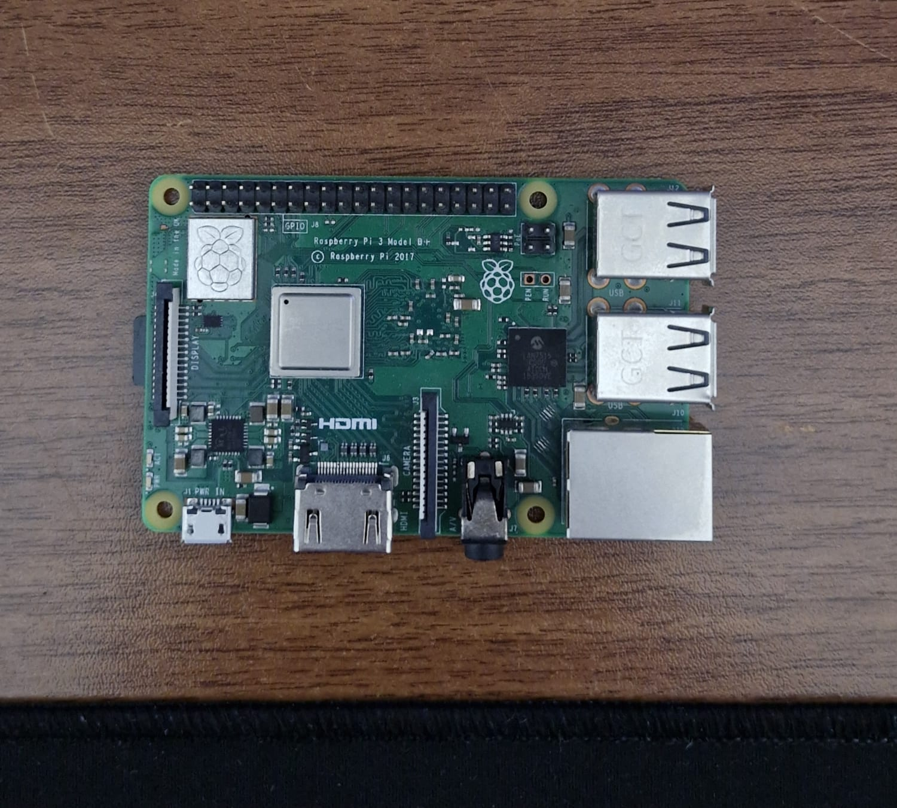
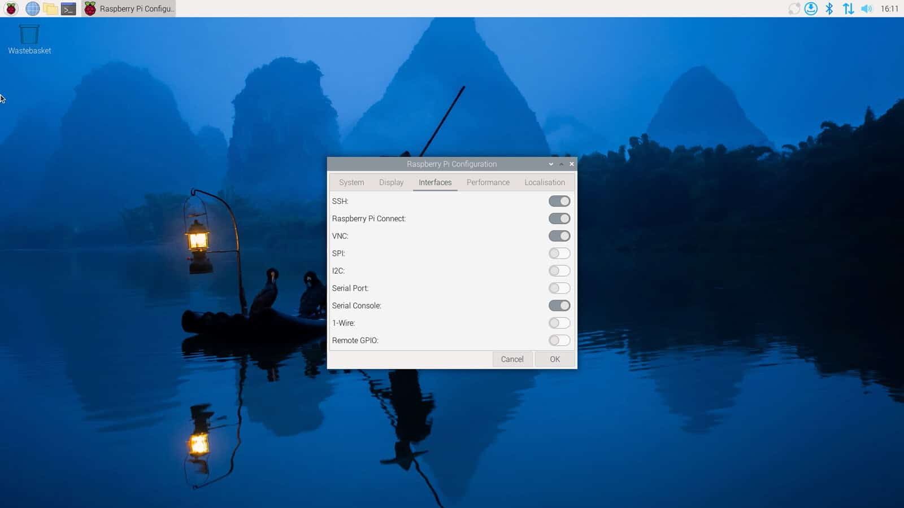

<h1 align="center">Federe ve Transfer Öğrenme - Ara Rapor</h1>

## 1. Proje Konusu
Bu proje, federated learning (federe öğrenme) ve transfer learning (aktarım öğrenmesi) yöntemlerinin farklı donanımlar üzerinde uygulanmasını ve karşılaştırılmasını amaçlamaktadır. Çalışmada Raspberry Pi, Orange Pi gibi tek kartlı bilgisayarlar, çeşitli yapay zeka modelleri ve farklı veri setleri kullanılacaktır. Projede, her iki öğrenme yaklaşımı için farklı modeller eğitilecek ve yöntemler başarı metrikleri açısından değerlendirilecektir.

## 2. Özet
Projenin bu aşamasına kadar geçen süreçte, federated learning (federe öğrenme) konusuna yönelik kapsamlı bir literatür taraması yapılmış ve bu alandaki güncel akademik çalışmalar incelenmiştir. Bu kapsamda iki ilgili bilimsel makale detaylı şekilde okunarak yöntemlerin temel çalışma prensipleri anlaşılmıştır. Uygulama aşamasına geçiş için kullanılan Raspberry Pi 3 Model B+ cihazı, merkezi sunucu görevi üstlenecek biçimde hazırlanmış; işletim sistemi kurulmuş, gerekli yazılım ortamı ve kütüphaneler eksiksiz şekilde yapılandırılmıştır. Ayrıca, federe öğrenme sürecinde eğitilecek modeller için uygun veri setleri araştırılmış ve proje kapsamına uygun veri kümeleri temin edilerek hazır duruma getirilmiştir.

## 3. Kullanılan Yöntemler

- **Federated Learning (Federe Öğrenme):** Verilerin cihazlarda yerel olarak işlenmesini sağlayan merkezi olmayan öğrenme yaklaşımıdır. Cihazlar, kendi yerel verileriyle modeli eğitir ve yalnızca model ağırlıklarını merkezi sunucuya gönderir.

- **Flower Framework:** Federated learning uygulamasını oluşturmak için kullanılan açık kaynaklı Python tabanlı bir kütüphanedir. Sunucu ve istemci bileşenleri ile esnek yapılandırma imkanı sağlar.

- **Raspberry Pi 3 Model B+:** Projede merkezi sunucu rolünü üstlenen tek kartlı bilgisayardır. Üzerine gerekli işletim sistemi kurulmuş ve yazılım ortamı yapılandırılmıştır.

- **Python Programlama Dili:** Model eğitimi, sunucu/istemci iletişimi ve veri ön işleme süreçlerinin tamamı Python diliyle gerçekleştirilmiştir.

- **PyTorch:** Derin öğrenme modellerinin eğitimi için kullanılan açık kaynaklı kütüphanedir. Transfer öğrenme süreçlerinde de kullanılacaktır.

- **Veri Seti Hazırlığı:** Eğitilecek modeller için uygun açık kaynak veri setleri araştırılmış ve seçilmiştir. Bu veri setleri cihazların işlem kapasitesine uygun şekilde optimize edilmiştir.

## 4. Yapılan Çalışmalar ve Görselleri

Proje kapsamında öncelikle federated learning (federe öğrenme) konusuna dair literatür taraması yapılmış ve güncel iki akademik makale detaylı biçimde incelenmiştir. Bu çalışmalar sonucunda yöntemin mimarisi, iletişim yapısı ve senkronizasyon mekanizmaları hakkında temel bilgiler elde edilmiştir.

Donanım tarafında Raspberry Pi 3 Model B+ cihazı merkezi sunucu olarak seçilmiş, cihaz üzerine Raspberry Pi OS kurulmuş ve Python programlama dili ile çalışmaya uygun yazılım ortamı yapılandırılmıştır. Flower kütüphanesi kurulmuş, test amaçlı temel bir federated learning altyapısı hazırlanmıştır.

Model eğitimi için kullanılacak açık kaynak veri setleri araştırılarak projeye uygun veri kümeleri belirlenmiştir. Bu veri setleri henüz sisteme entegre edilmemiştir ancak ilerleyen aşamalarda kullanılmak üzere hazır durumdadır.

### Görseller

- Raspberry Pi cihazının fiziksel görünümü:  
  

- Raspberry Pi OS masaüstü ekran görüntüsü:  
  

## 5. Elde Edilen Sonuçlar

- Federated learning (federe öğrenme) yöntemine yönelik literatür araştırması yapılmış ve iki akademik çalışma detaylı biçimde incelenmiştir.
- Eğitim sürecinde kullanılabilecek uygun veri setleri araştırılmış ve proje kapsamına göre belirlenmiştir.
- Sunucu olarak görev yapacak Raspberry Pi 3 Model B+ cihazı hazırlanmış, üzerine Raspberry Pi OS kurulmuştur.
- Python ortamı ve gerekli yazılım bağımlılıkları cihaza başarıyla yüklenmiştir.
- Flower framework, sunucu olarak görev yapan Raspberry Pi cihazına kurulmuş ve federated learning altyapısının çalıştırılması için hazır hale getirilmiştir.
- Sunucu tarafındaki hazırlıklar tamamlanmış olup, istemci cihazlar için yapılandırma süreci bir sonraki aşamada gerçekleştirilecektir.

## 6. Karşılaşılan Sorunlar ve Çözümler

| Karşılaşılan Sorun | Çözüm Yolu |
|---------------------|------------|
| Proje konusuyla doğrudan ilişkili veri seti sayısının az olması nedeniyle uygun veri seti bulmakta zorluk yaşanmıştır. | Farklı açık kaynak platformlarda araştırma yapılarak içerik açısından en uygun veri setleri manuel olarak seçilmiştir. |
| Raspberry Pi cihazına gerekli yazılım ortamı ve bağımlılıkların kurulumu sırasında paket yükleme ve güncelleme hataları meydana gelmiştir. | Sistem güncellemeleri yapılmış, eksik paketler manuel olarak terminal üzerinden kurulmuştur. |

## 7. Projenin Devamında Yapılacaklar

- Federated learning ortamında istemci olarak görev yapacak diğer Raspberry Pi cihazlarının hazırlanması ve yapılandırılması  
- Tüm cihazlar arasında haberleşmeyi sağlayacak ağ altyapısının test edilmesi ve senkronizasyonun sağlanması  
- Uygun veri setlerinin istemcilere dağıtılması ve cihazların yerel model eğitimi gerçekleştirecek şekilde yapılandırılması  
- Flower framework kullanılarak federated learning deneylerinin başlatılması  
- Eğitim sürecinde elde edilen sonuçların (doğruluk, eğitim süresi, iletişim maliyeti vb.) kaydedilmesi ve değerlendirilmesi  
- Elde edilen verilerle transfer learning yöntemiyle yapılan sonuçlarla karşılaştırma yapılması  
- Projeye ait bitirme raporunun hazırlanması ve sunum materyallerinin oluşturulması

