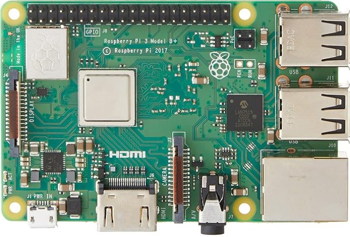
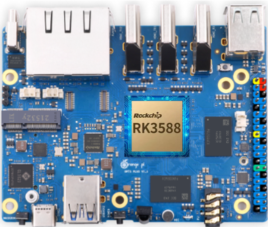

<h1 align="center">Federe ve Transfer Öğrenme</h1>

## 1. Proje Konusu
Bu proje, federated learning (federe öğrenme) ve transfer learning (aktarım öğrenmesi) yöntemlerinin farklı donanımlar üzerinde uygulanmasını ve karşılaştırılmasını amaçlamaktadır. Çalışmada Raspberry Pi, Orange Pi gibi tek kartlı bilgisayarlar, çeşitli yapay zeka modelleri ve farklı veri setleri kullanılacaktır. Projede, her iki öğrenme yaklaşımı için farklı modeller eğitilecek ve yöntemler başarı metrikleri açısından değerlendirilecektir.

## 2. Proje Hedefleri
- Federe öğrenme ve transfer öğrenme yöntemlerini farklı donanımlar üzerinde uygulamak  
- Farklı veri setleri ve yapay zeka modelleri ile her yöntemi ayrı ayrı değerlendirmek  
- Eğitim süresi, doğruluk oranı ve işlem yükü gibi başarı metrikleri üzerinden yöntemleri karşılaştırmak  
- Donanım ve yöntem çeşitliliğine göre performans farklılıklarını analiz etmek  
- Elde edilen sonuçlarla yöntemlerin verimliliğini ve uygulanabilirliğini ortaya koymak  

## 3. Tahmini Zaman Çizelgesi

| Görev                                              | Süre      | Açıklama                                                                 |
|----------------------------------------------------|-----------|--------------------------------------------------------------------------|
| Konu araştırması, literatür taraması ve altyapı incelemeleri | 2 Hafta   | Federe ve transfer öğrenme yöntemlerinin araştırılması, donanım ön hazırlığı yapılması |
| Donanım Kurulumu ve Ağ Yapılandırması              | 2 Hafta   | Raspberry Pi ve Orange Pi sistemlerinin kurulumu ve ağ bağlantılarının yapılandırılması |
| Federe Öğrenme Deneylerinin Gerçekleştirilmesi     | 2 Hafta   | Federated learning uygulamasının geliştirilmesi ve donanımlarda test edilmesi (Farklı modeller ve veri setleriyle denemeler) |
| Transfer Öğrenme Deneylerinin Gerçekleştirilmesi   | 2 Hafta   | Transfer learning uygulamasının gerçekleştirilmesi donanımlarda test edilmesi (Farklı modeller ve veri setleriyle denemeler) |
| Karşılaştırma ve Performans Analizi                | 1 Hafta   | Gerekli metrikler kullanılarak farklı modellerin federe ve transfer öğrenme yöntemleriyle eğitilmesi sonucunda elde edilen sonuçların karşılaştırılması ve performans analizinin gerçekleştirilmesi |
| Revizyon ve İyileştirme                            | 1 Hafta   | Gerekli düzeltmelerin yapılması ve sonuçların netleştirilmesi             |
| Tez Yazımı ve Raporlama                            | 2 Hafta   | Proje raporunun yazılması, düzenlenmesi ve sunum için hazırlanması        |

## 4. Kaynak Planlaması

### Görev Dağılımı
**Proje Sahibi:** Osman Çamkerten  
Projenin tüm aşamaları tek bir kişi tarafından yürütülmektedir. Osman Çamkerten, proje sahibidir ve tüm görevleri üstlenmektedir.

### Ana Donanımlar

| Donanım                        | Gör                                                                                                     |
|--------------------------------|-----------------------------------------------------------------------------------------------------------|
| **Raspberry Pi 3 Model B+**    |                     |
| **Orange Pi 5 Plus (8GB)**     |                             |

### Kullanılacak Ekipmanlar ve Maliyetler

| Donanım/Ekipman               | Adet      | Birim Fiyat (₺) | Toplam Fiyat (₺) | Açıklama                                         |
|-------------------------------|-----------|------------------|-------------------|--------------------------------------------------|
| Raspberry Pi 3 Model B+       | 3         | 1.681,40         | 5.044,20          | Projede kullanılan temel donanım                |
| 5.1V 2.5A Güç Adaptörü        | 3         | 480              | 1.440             | Her Raspberry Pi için ayrı güç kaynağı          |
| 64 GB microSD Kart            | 4         | 268              | 1.072             | Tüm cihazlar için işletim sistemi               |
| Ethernet Kablosu              | 1         | 66               | 66                | IP ayarlama ve ağ bağlantısı                    |
| HDMI Kablosu                  | 1         | 150              | 150               | Masaüstü ve ilk kurulum için                        |
| Orange Pi 5 Plus (8GB)        | 1         | 8.207            | 8.207             | Projede kullanılan temel donanım                |
| USB-C Adaptör (Orange Pi)     | 1         | 683              | 683               | Orange Pi için güç adaptörü                     |
| USB Wi-Fi Adaptör             | 1         | 407              | 407               | Orange Pi için internet bağlantısı              |
| Soğutucu / Fan (Heatsink)     | 1         | 547              | 547               | Orange Pi 5 Plus için soğutma                   |
| **Toplam Maliyet**            |           |                  | **17.616,20 ₺**     |                                                  |

### Kullanılacak Yazılımlar

- **YOLOv7**: Nesne tespiti için kullanılacak ana model altyapısıdır.  
- **Python**: Tüm model eğitim süreçleri ve ağ haberleşme kodları Python ile yazılacaktır.  
- **PyTorch**: YOLOv7 modelinin eğitimi ve transfer öğrenme işlemleri için kullanılacaktır.  
- **OpenCV**: Görüntü işleme işlemlerinde destekleyici olarak kullanılacaktır.  
- **Flower**: Federe öğrenme sisteminin kurulması ve yönetimi için kullanılacaktır.  
- **Git & GitHub**: Proje dosyalarının versiyon kontrolü ve yedeklenmesi için kullanılacaktır.  
- **Linux tabanlı işletim sistemi** (Raspberry Pi OS / Ubuntu): Cihazlarda sistem kurulumu için kullanılacaktır.

**İlerleyen aşamalarda proje ihtiyacına göre ek yazılımlar da dahil edilebilir.**

## 5. Risk Analizi

| **Olası Risk**                   | **Açıklama**                                                                 | **Çözüm Önerisi**                                                             |
|----------------------------------|------------------------------------------------------------------------------|--------------------------------------------------------------------------------|
| Donanım Uyumsuzlukları          | Raspberry Pi ve Orange Pi gibi farklı donanımlar arasında uyumsuzluk yaşanabilir | Her donanım ayrı test edilmeli, yazılım esnek biçimde yapılandırılmalı     |
| Ağ İletişimi Problemleri        | Federated learning sırasında cihazlar arasında bağlantı sorunları oluşabilir | Stabil bağlantı ve yerel ağ üzerinde ön testler yapılmalıdır               |
| Model Aktarımı Hataları         | Model ağırlıklarının senkronize edilmesinde hata riski vardır               | Ağırlıkların bütünlüğünü kontrol eden mekanizmalar eklenmelidir             |
| Yetersiz Donanım Kaynakları     | Bazı işlemler donanımların sınırlarını zorlayabilir                         | Daha hafif modeller seçilmeli veya işlem yükü optimize edilmelidir          |
| Yazılım Hataları ve Çakışmalar  | Kullanılan kütüphaneler veya sürümler arasında uyumsuzluk çıkabilir         | Sanal ortamlar kullanılmalı, sürümler kontrol altında tutulmalıdır          |
| Aşırı Isınma                    | Raspberry Pi/Orange Pi uzun çalışmalarda aşırı ısınabilir                   | Soğutucu/fan kullanılmalı, hava sirkülasyonu sağlanmalıdır                  |
| Elektrik Çarpması Riski         | Adaptör ya da bağlantılar üzerinden kullanıcıyı etkileyebilir               | Kaliteli adaptör kullanılmalı, bağlantılar izole edilmelidir                |
| Statik Elektriklenme Riski      | Cihaza çıplak elle, fiş çekildikten hemen sonra dokunmak zarar verebilir    | Fiş çekildikten sonra bir süre beklenmeli, topraklama önlemi alınmalı       |
| SD Kart Zarar Görmesi           | SD kartlar sık yazma/silme işlemleri veya ani güç kesintileri nedeniyle bozulabilir | Kaliteli SD kart tercih edilmeli, ani kesintilerden önce sistem güvenli şekilde kapatılmalı |

## 6. Ticari Potansiyel

Projenin ticari potansiyeli şu şekillerde öne çıkmaktadır:

- Sınırlı donanım kaynaklarında yapay zeka modellerinin uygulanabilirliğini göstererek maliyet etkin çözümler sunar.  
- Gömülü sistemler ve edge computing alanlarında değerlendirilerek ticari ürünlere dönüştürülebilir.  
- Aşağıdaki alanlarda potansiyel kullanım sahasına sahiptir:  
  - Eğitim teknolojileri  
  - Savunma sanayii uygulamaları  
  - IoT (Nesnelerin İnterneti) cihazları  
  - Endüstriyel otomasyon sistemleri  
- Kamu kurumları, özel sektör ve eğitim kurumları için özelleştirilmiş yapay zeka çözümleri üretilebilir.

